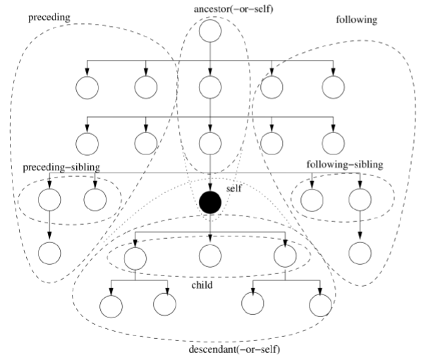

# XML
## DTD
- Faire un arbre et checker que tout vas bien. **Ordre important**
- La balise après le DOCTYPE doit indiquer la balise à la racine du document.
- ~~(#PCDATA, balise1, balise2)~~ FAUX => (#PCDATA | balise1 | balise2) OK
- `+` = [1-n]
- `*` = [0-n]  
- `?` = [0-1]
- On peut utiliser `EMPTY` pour un élément vide, mais en général avec des attributs
```
<!ELEMENT menu EMPTY>
<!ATTLIST menu 
    nom CDATA #REQUIRED
    prix CDATA #REQUIRED
>
```

Ca ressemble à ça une DTD pour un elm restaurant
```
<!ELEMENT base (restaurant|ville)*>
<!ELEMENT restaurant (fermeture?, menu, menu+)>
<!ATTLIST restaurant 
    nom CDATA #REQUIRED
    etoile (0|1|2|3) #IMPLIED
    ville IDREF #REQUIRED
>
```

### Attribut
```xml
<!ATTLIST Balise 
    nom type mode
    nom type mode
>
```

Liste des types :
- **CDATA** : la valeur de l 'attribut est une chaîne de caractères
- **ID** : identificateur d 'élément, **IDREF(S)** : renvoi vers un (des) ID. Ici c'est ez, **tous les ID sont uniques** donc on idref juste vers un ID existant.
- NMTOKEN(S) : un ou des noms symboliques (sans blanc)
- `(value1 | value2 | value3)` liste 
- ENTITY(IES) : entités externes non XML
Liste des mode :
- Une valeurs par default
- `#FIXED` une constante
- `#REQUIRED` Attribut requis
- `#IMPLIED` Attribut facultatif
- 

# XSchema
## Généralité
- Ordre des séquences importants
- Cardinalité précise
- On a des type simple et des type complexes, qu'on imbrique dans des balise `<xs:element>`

### Balise element
```xml
<xs:element name="restaurant" minOccurs="0" maxOccurs="unbounded">
    <xs:complexeType>..... </xs:complexType>
</xs:element>
```

### Type simple 
- `xs:string`
- `xs:decimal`
- `xs:integer`
- `xs:boolean`
- `xs:date`
- `xs:time`
```xml
<xs:element name="start_date" type="xs:date"/>
```

### Type complexe
- empty elements
- elements that contain only other elements
- elements that contain only text
- elements that contain both other elements and text

A l'intérieur d'un `<xs:complexType>` on a toujours soit :
- Un `<xs:choice name="" type="">` 
- Un `<xs:sequence name="" type="">`
- => Qui contienne des `<xs:element>`. 

Et ensuite des `<xs:attribute name="" type="">`

#### Exemple
Complex Example + **héritage**
~~~~xml
<xs:element name="employee" type="personinfo"/>
<xs:element name="student" type="personinfo"/>

<xs:complexType name="personinfo">
  <xs:sequence>
    <xs:element name="firstname" type="xs:string"/>
    <xs:element name="lastname" type="xs:string"/>
  </xs:sequence>
</xs:complexType>

<xs:element name="professor" type="fullpersoninfo">

<xs:complexType name="fullpersoninfo">
  <xs:complexContent>
    <xs:extension base="personinfo">
      <xs:sequence>
        <xs:element name="address" type="xs:string"/>
        <xs:element name="city" type="xs:string"/>
        <xs:element name="country" type="xs:string"/>
      </xs:sequence>
    </xs:extension>
  </xs:complexContent>
</xs:complexType> 
~~~~

Empty Element
~~~~xml
<xs:complexType name="prodtype">
  <xs:attribute name="prodid" type="xs:positiveInteger"/>
</xs:complexType>
~~~~

Text only + attribute
~~~~xml
<xs:complexType name="shoetype">
  <xs:simpleContent>
    <xs:extension base="xs:integer">
      <xs:attribute name="country" type="xs:string" />
    </xs:extension>
  </xs:simpleContent>
</xs:complexType>
~~~~

Integer only + Attirbute + attribute restriction
~~~~xml
<xs:complexType>
  <xs:simpleContent>
    <xs:extension base="xs:integer">
      <xs:attribute name="unit">
        <xs:simpleType>
          <xs:restriction base="xs:string">
            <xs:length value="3" />
          </xs:restriction>
        </xs:simpleType>
      </xs:attribute>
    </xs:extension>
  </xs:simpleContent>
</xs:complexType>
~~~~


## Restriction
### Sur le nombre d'élément max 
On utilise `minOccurs="0" maxOccurs="unbounded"` dans les `xs:element`, `xs:choice`, `xs:sequence`.

### Unicité
On créer une clé pour garantir l'unicité d'un élement. 
```xml
<xs:element name='clients'>
    <xs:complexType>
    <xs:sequence>
        <xs:element name='client' minOccurs='0' maxOccurs='unbounded'>
            <xs:complexType name='ClType'>
                <xs:sequence>
                    <xs:element name='nom' type='xs:string' />
                    <xs:element name='prenom' type='xs:string' />
                    <xs:element name='dateNaissance' type='xs:string' />
                </xs:sequence>
                <xs:attribute name='clientID' type='xs:integer' />
            </xs:complexType>
        </xs:element>
    </xs:sequence>
    </xs:complexType>
    
    <!-- /!\ Placement important /!\ -->
    <xs:key name="clientUnique">
        <xs:selector xpath="client"/>
        <xs:field xpath="@clientId"/>
    </xs:key>
</xs:element>
```

### Sur le contenu
Il faut recreer un type simple qui contient une restriction
```xml
<xs:simpleType name="costInt">
    <xs:restriction base="xs:integer">
        <xs:minInclusive value="10"></xs:minInclusive>
    </xs:restriction>
</xs:simpleType>
```
- `xs:minInclusive `
- `xs:maxInclusive`
- `xs:minExclusive`
- `xs:maxExclusive`
- `xs:enumeration`
- `xs:pattern`
- `xs:whiteSpace`
- `xs:length`
- `xs:minLength`
- `xs:maxLength`
- `xs:totalDigits`
- `xs:fractionDigits`

### Min-max
~~~~xml
<xs:element name="age">
  <xs:simpleType>
    <xs:restriction base="xs:integer">
      <xs:minInclusive value="0"/>
      <xs:maxInclusive value="120"/>
    </xs:restriction>
  </xs:simpleType>
</xs:element> 
~~~~

### Enumeration

~~~~xml
<xs:element name="car" type="carType"/>

<xs:simpleType name="carType">
  <xs:restriction base="xs:string">
    <xs:enumeration value="Audi"/>
    <xs:enumeration value="Golf"/>
    <xs:enumeration value="BMW"/>
  </xs:restriction>
</xs:simpleType>
~~~~

## Ref
- Les `key` et `keyref` la racine du parent commun. `@` lorsqu'on pointe sur un attribut
```xml
<!-- Ville : Key -->
<xs:key name="idVille">
    <xs:selector xpath="ville"></xs:selector>
    <xs:field xpath="@nom"></xs:field>
</xs:key>

<!-- Restaurant Ref ville -->
<xs:keyref refer="idVille" name="refVille">
    <xs:selector xpath="restaurant"></xs:selector>
    <xs:field xpath="@ville"></xs:field>
</xs:keyref>
```

# XPath
- `//` au début pour chercher parmis tous l'arbre DOM
- `/` pour faire un chemin dans l'arbre DOM
- `..` pour accédé au parent, attention un attribue est un fils dans l'arbre DOM
- `element[condition and condition or nor(condition)]`
- `A!=N` est vrai si la valeur textuelle d'un des noeuds est différente de la valeur textuelle de A.
- fonction **contains()** : `//restaurant[contains(menu/@nom, @ville)]` mais si il y a plusieurs menu il est pas sûr du comportement de contain donc pour être sur on fait `//restaurant[menu[contain(@nom, ../@ville)]]`
- fonction **count(menu)**
- Les foreign key : `//ville[@nom = //restaurant/@ville[count(menu) >= 4]]` ou `//restaurant[@ville = //ville[count(plusBeauMonument) = 0]/@nom`
- **Position**, 
    - Plus safe d'utiliser à partir de `descendant::menu[5]` plutôt que `//`=`descendant-or-self::` : 
      -  `descendant::menu[5]` 5ème menu du document : **pas de contexte self**
      -  `descendant-or-self::menu[5]` Le 5ème menu de chaque restaurant : **avec contexte self**
    - `last()` pour le dernier element mais attention c'est particulier aussi
    - `preceding-sibling`, ect ... voir image pour les voisins
- `//ville[@nom = //restaurant/@ville[count(./menu) >= 4]]`



# XQuery
Classiquement : **for — let — where - order by - return**
```xml
<results>{
  for $r in //restaurant
  where $r/@etoile = 2
  return (

  )
}</results>
```
Imbriquer les boucles
```xml
<result>{
    for $b in //book, $t in $b/title, $a in $b/author
    return
        <result>
            {$t}
            {$a}
        </result>
}</result>
```
Equivalent à 
```xml
<results>{
  for $b in //book
  return (
    for $a in $b/author
      return (
        <result>
         {$b/title}
         {$a}
        </result>
      )              
  )
}</results>
```
## For loop
The For Clause
To loop a specific number of times in a for clause, you may use the to keyword.

This
```
for $x in (1 to 5)
return <te­st>­{$x­}</­tes­t>
```
Returns
```xml
<te­st>­1</­tes­t>
<te­st>­2</­tes­t>
<te­st>­3</­tes­t>
<te­st>­4</­tes­t>
<te­st>­5</­tes­t>
```

To count the iteration use the at keyword

This
```xml
for $x at $i in doc("bo­oks.xm­l")/­boo­kst­ore­/bo­ok/­title
return <bo­ok>­{$i}. {data(­$x)­}</­boo­k>
```
Returns
```xml
<bo­ok>1. Everyday Italia­n</­boo­k>
<bo­ok>2. Harry Potter­</b­ook>
<bo­ok>3. XQuery Kick Start<­/bo­ok>
<bo­ok>4. Learning XML</b­ook>
```

it is also allowed with more than one expression in the for clause. Use comma to separate each in expres­sion.

This
```xml
for $x in (10,20), $y in (100,200)
return <te­st>­x={$x} and y={$y}­</t­est>
```
Returns
```xml
<te­st>x=10 and y=100<­/te­st>
<te­st>x=10 and y=200<­/te­st>
<te­st>x=20 and y=100<­/te­st>
<te­st>x=20 and y=200<­/te­st>
```
## Jointure
```xml
<books-with-prices>{
  for $b in /bib/book,
      $r in  /reviews/entry
  where $b/title=$r/title
  return <book-with-prices>
      {$b/title}
      <price-review>{$r/price/text()}</price-review>
      <price-bib>{$b/price/text()}</price-bib>
 </book-with-prices>
}
</books-with-prices>
```

## Order by 
Classique
```xml
for $x in doc("bo­oks.xm­l")/­boo­kst­ore­/book
order by $x/@ca­tegory, $x/title
return $x/title
```

## Expression conditionnel
```xml
<books>{
  for $x in //book
  return
    <book>
      { $x/title } 
      est {
        if ($x/@year > 1999)
        then "récent"
        else "ancient"
      }
    </book>
}
</books>
```
Some et Exist DIAPO 32

## Autre truc maybe utile
Opérateurs séquences:
- union: union
- différence : except
- intersection : intersect
- Distinct-value() : concat les str de l'objet pour faire un id DIAPO 38
Fonctions : count(), last(), first(), contains()...
